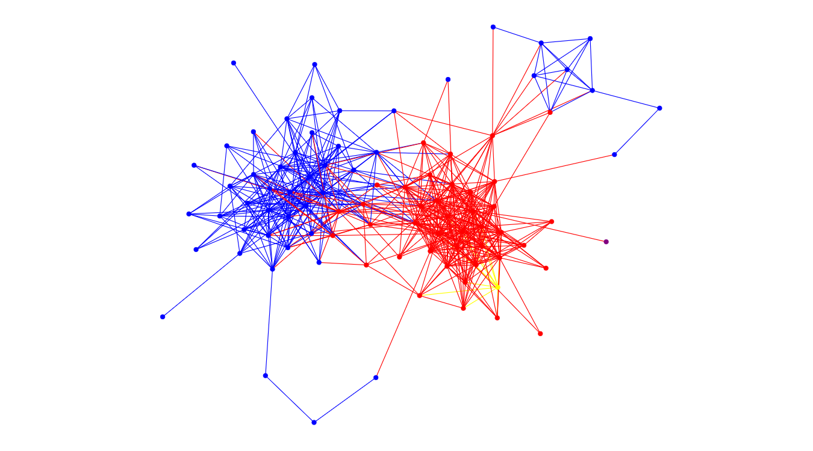
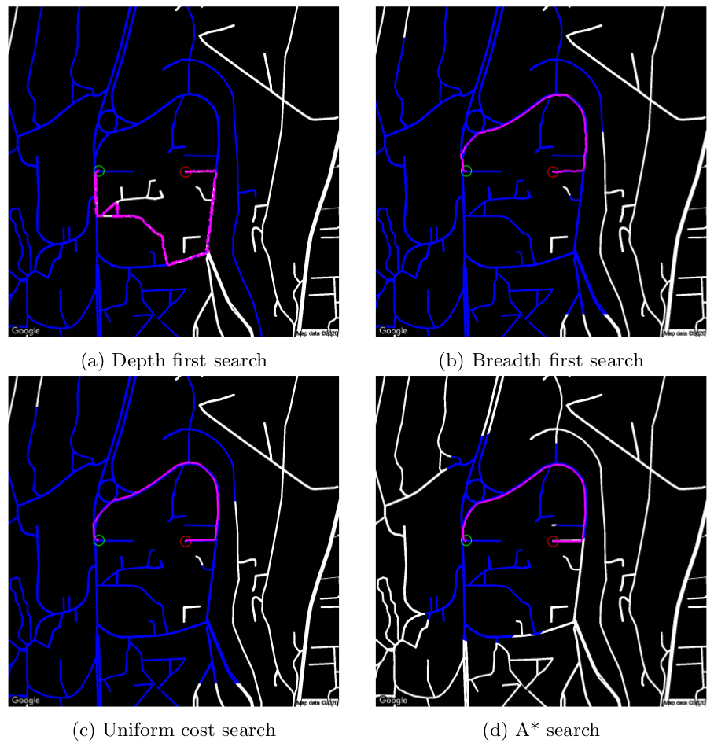
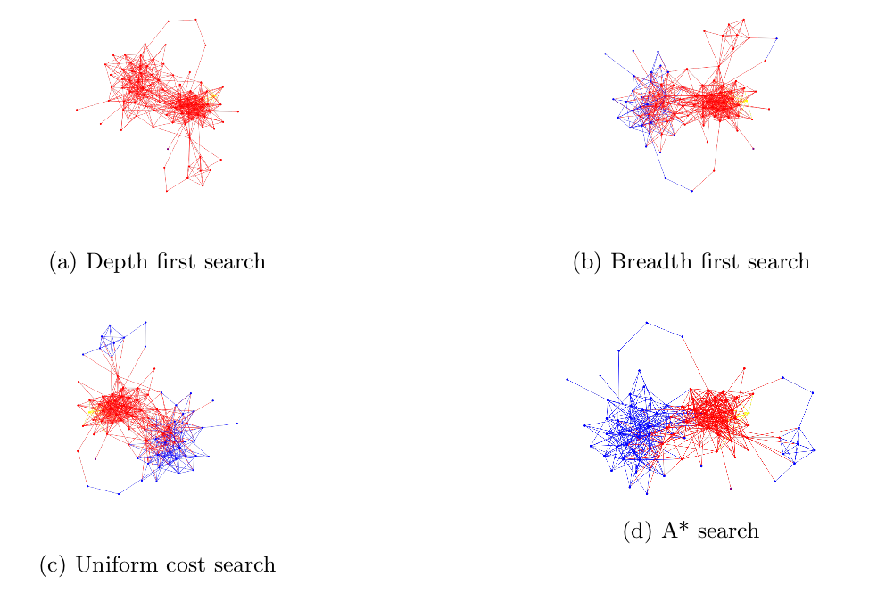

# comparison-of-search-algorithms
2 different problems are applied 4 different search algorithm: depth first search, breadth first search, uniform cost search and A*.

### Problem 1:

Moving operation from a point to another is a challenging problem in robotics. There are a number of issues that have to be considered such as mapping&localization (visual or normal slam), navigation, etc.. One of them is path findinding. Path finding includes finding the shortest path which helps the robot to change position itself from one point to another one.

### Problem 2:

COVID-19 Open Research Dataset Challenge (CORD-19) 3 is a call for AI researchers to contribute COVID-19 literature. The Challenge includes a great dataset which named CORD-19 dataset. The dataset consists of academic papers from several archives such as PMC, BioRxiv/MedRxiv, Arxiv, etc..

First step is creating a unique problem from this dataset. Since dataset contains a lot of papers (63,000 scholarly articles, including over 51,000 with full text), searching related papers is really challenging. The idea is that if 2 papers are defined as start and goal paper as a node in a paper graph, a search algorithm can find goal paper from start paper as well as related papers in the path. As a result, we have 2 related papers and also a related paper list.

## Data
- Map images are provided for problem 1.
- COVD-19 Dataset is not provided in repository. It can be downloded [here](https://www.kaggle.com/allen-institute-for-ai/CORD-19-research-challenge). IDs can be found given in similarity.txt
- Similarities are provided for problem 2.

# Notes
- Python recursion limit is increased to be able to visualize traced path in problem 2.
- Report is also provided. More detail can be found in the report.
- All outputs are provided.

References
- [COVD-19 Challenge](https://www.kaggle.com/allen-institute-for-ai/CORD-19-research-challenge)